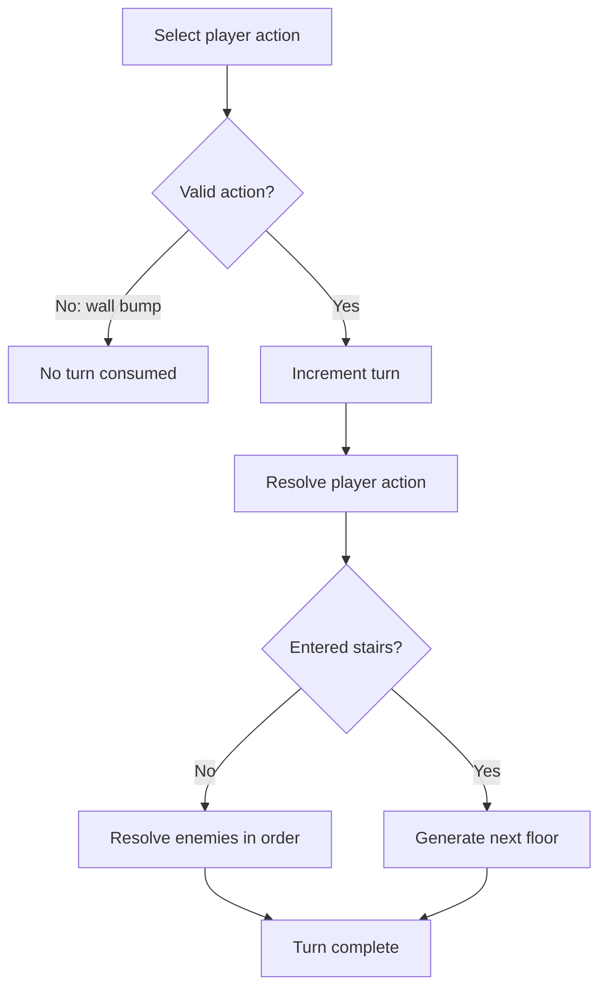

# Simulation specification v1

This document describes the simulation that is currently implemented in
`game/scripts/main.gd`. It is a behavioral baseline for extracting the simulation
from Godot into a headless process or server. It does not prescribe the future DSL
or API design.

`game/scenes/main.tscn` attaches only `main.gd`. The older `player.gd`, `enemy.gd`,
and `dungeon_generator.gd` files are not part of the running scene and are therefore
outside this specification.

The words **must** and **must not** below mean “must behave this way to reproduce
the current implementation.” Deliberate changes are allowed, but should be made as
a new specification version and recorded in the run log.

## 1. Scope and boundaries

The current `main.gd` combines three responsibilities:

| Responsibility | Current contents | Extraction target |
| --- | --- | --- |
| Simulation | Map generation, actors, combat, progression, turn resolution, strategies | A deterministic core with no UI dependency |
| Orchestration | Restart, same-seed comparison, automatic turn interval, run lifecycle | A batch runner or API service |
| Presentation | Godot drawing, buttons, keyboard input, arrow animation, HUD messages | Godot replay client and web log viewer |

Only simulation state should determine a turn result. Wall-clock timestamps,
animation progress, viewport scale, buttons, and labels are not simulation state.

The current implementation does not yet enforce this boundary. In particular, map
dimensions are derived from the viewport. Section 12 lists such dependencies that
must be resolved when the core is extracted.

## 2. Coordinates and map

- A position is an integer pair `(x, y)` represented by `Vector2i` in Godot.
- The origin is the top-left tile. Positive `x` is right and positive `y` is down.
- Cardinal neighbor order is **up, down, left, right**. This order is observable in
  pathfinding and tie-breaking.
- Tile `0` is a wall and tile `1` is a floor.
- A tile is walkable when it is within the map and is a floor tile.
- Actors do not occupy wall tiles.
- The player and an enemy cannot occupy the same tile.
- Two enemies cannot occupy the same tile.
- The stairs are placed on a floor tile and do not block movement.

## 3. State model

### 3.1 Scenario and run state

| Field | Type | Initial/reset value | Meaning |
| --- | --- | --- | --- |
| `scenario_seed` | integer | Generated on a new scenario | Shared seed used to compare strategies |
| `strategy` | enum | `aggressive_v1` or `cautious_v1` | Policy selecting player actions |
| `run_id` | string | New value per run | Log identity; not simulation input |
| `turn` | integer | `0` | Number of accepted player turns |
| `depth` | integer | `1` | Current dungeon floor |
| `game_over` | boolean | `false` | True after player HP reaches zero |
| `decision_sequence` | integer | `0` | Monotonic automatic-decision counter |
| `event_sequence` | integer | `0` | Monotonic log-event counter |
| `next_enemy_id` | integer | `1` | Source for run-local enemy IDs |

A same-seed comparison consists of two independent runs. The aggressive run is
executed first, then the cautious run is restarted with the same `scenario_seed`.
Player statistics, depth, turn count, decision count, event count, and enemy ID
allocation are reset between the two runs.

### 3.2 Player state

| Field | Initial value |
| --- | ---: |
| Position | Center of the first generated room |
| HP / maximum HP | `18 / 18` |
| Attack | `5` |
| Gold | `0` |
| Score | `0` |
| Level | `1` |
| XP | `0` |
| Depth | `1` |

The implementation stores depth inside the player dictionary. In a separated core
it may be run state, provided observable behavior is unchanged.

### 3.3 Enemy state

Each enemy has a run-local string ID, type, position, HP, maximum HP, attack, and a
display color. Color is presentation-only.

| Type | HP at depth `d` | Attack at depth `d` | Kill XP |
| --- | ---: | ---: | ---: |
| Melee | `8 + 2d` | `2 + d` | `3` |
| Archer | `5 + d` | `1 + d / 2` in current GDScript | `5` |

Enemy IDs are allocated in spawn order as `enemy-1`, `enemy-2`, and so on. Enemy
array order is significant because it determines both enemy turns and some ties in
player targeting.

### 3.4 Floor state

A floor contains:

- map width and height;
- a rectangular tile grid;
- the accepted rooms in generation order;
- the player position;
- the stairs position; and
- the ordered enemy collection.

## 4. Randomness and reproducibility

The current implementation creates independent random streams per floor:

```text
floor seed = hash("<scenario_seed>:floor:<depth>")
spawn seed = hash("<scenario_seed>:spawn:<depth>")
reward seed = hash("<scenario_seed>:reward:<depth>:<enemy_id>")
```

- The floor stream controls room sizes, positions, and corridor orientation.
- The spawn stream controls whether an intermediate room gets an enemy, the enemy
  position, and its type.
- A fresh reward stream controls gold for one defeated enemy.
- Enemy rewards therefore do not perturb later floor or spawn generation.
- Given the same scenario seed, depth, map dimensions, and implementation, both
  strategies must receive the same initial floor and enemy population.

The initial `scenario_seed` is generated from Godot's global random source. The
`run_id` also includes a global random value, but the run ID must not influence the
simulation.

Godot's `String.hash()` is currently part of seed derivation. A server implemented
in another language must either reproduce that algorithm exactly or introduce a
specified cross-platform hash in a later specification version.

## 5. Floor generation

At the beginning of a floor:

1. Clear rooms, enemies, and presentation arrow effects.
2. Fill the map with walls.
3. Set the target room count to
   `max(2, round(map_width * map_height / 112.0))`.
4. Attempt at most `target_room_count * 8` candidate rooms.
5. For every candidate, choose width and height independently in `[5, 11]` and
   choose a position that keeps it within the map.
6. Reject it when the rectangle grown by one tile intersects an accepted room.
7. Carve an accepted room into floor tiles.
8. Connect every room after the first to the previous room's center with an
   L-shaped corridor. Randomly choose horizontal-first or vertical-first.
9. If no room was accepted, use the fallback room `(4, 4, 12, 10)`.
10. Put the player at the first room's center and the stairs at the last room's
    center.
11. Spawn enemies in intermediate rooms only.

For each room whose index is from `1` through `rooms.size() - 2`:

1. Spawn nothing with probability `25%`.
2. Otherwise choose a random interior tile, excluding the perimeter.
3. Choose melee or archer with equal probability.
4. Append the enemy to the ordered enemy collection.

No enemy is spawned in the first or last room. The implementation relies on room
separation and interior placement rather than performing an additional occupancy
check at spawn time.

## 6. Turn contract

A turn represents one accepted player action, followed in most cases by one enemy
phase. Rendering and arrow animation do not advance turns.



### 6.1 Action semantics

| Player action | Consumes a turn | Player moves | Enemy phase |
| --- | --- | --- | --- |
| Move into a wall or outside the map | No | No | No |
| Move into an enemy | Yes | No; attacks it | Yes, unless player action has already ended the run (not currently possible) |
| Move into an empty floor tile | Yes | Yes | Yes |
| Move onto the stairs | Yes | Yes | **No**; next floor starts immediately |
| Wait | Yes | No | Yes |

An automatic decision that has no available direction becomes a wait and consumes a
turn. A manual `.` wait has the same simulation effect.

### 6.2 Stair transition

When the player enters the stairs tile:

1. Increment depth by one.
2. Restore `4` HP, capped at maximum HP.
3. Generate the new floor from the new depth.
4. Skip the old floor's enemy phase.

There is no final depth or victory state. A run continues until player defeat or an
external restart.

## 7. Player combat and progression

When the player attacks an enemy:

1. Subtract player attack from enemy HP.
2. If the enemy survives, leave it in its current array position.
3. If it dies, remove it from the enemy collection and award:
   - `1` through `4` gold from its deterministic reward stream;
   - `2` score; and
   - `3` XP for melee or `5` XP for archer.
4. Apply all earned level-ups.

The XP threshold for the next level is `current_level * 8`. While XP meets or
exceeds the threshold:

1. subtract the threshold;
2. increment level;
3. add `2` maximum HP;
4. restore `2` HP, capped at the new maximum; and
5. add `1` attack.

The current code does **not** award one score per turn. Score changes only by `+2`
on a kill.

## 8. Enemy phase

Enemies act once each in current array order. Stop the phase immediately when the
player dies. An enemy may move only to a walkable tile that contains neither the
player nor another enemy.

For movement toward the player, an enemy selects one cardinal step:

1. Prefer the horizontal axis only when `abs(dx) > abs(dy)`; otherwise prefer the
   vertical axis.
2. If the preferred step is not walkable, try the other axis.
3. If neither step is walkable, do not move.

The final occupancy check can still reject the selected step. Enemies do not search
around actors or obstacles.

“Can see the player” currently means squared Euclidean distance is at most `80`.
Walls do not block vision or projectiles.

### 8.1 Melee enemy

1. If cardinally adjacent to the player, deal the enemy's attack damage.
2. If the player dies, end the run immediately.
3. If the player is within detection range, try one movement step toward the
   player.

An adjacent melee enemy reaches step 3 after attacking, but its selected movement
normally targets the occupied player tile and is rejected.

### 8.2 Archer enemy

Let `distance_squared` be the squared Euclidean distance to the player.

1. If `distance_squared <= 2`, try to retreat. Candidate tiles are considered in
   this order: diagonal away, horizontal away, vertical away.
2. If every retreat candidate is invalid, deal fixed `1` contact damage.
3. Otherwise, if `distance_squared <= 49`, fire an arrow and deal the archer's
   attack damage. The arrow animation delays subsequent processing in the Godot UI
   but does not create an additional simulation turn.
4. Otherwise, if `distance_squared <= 80`, try one movement step toward the player.
5. Otherwise, do nothing.

## 9. Automatic strategies

Both policies emit a decision record before applying the selected action. A policy
selects a cardinal direction or wait; it does not mutate state directly.

### 9.1 Aggressive (`aggressive_v1`)

Rules are evaluated in this order:

1. If an enemy is cardinally adjacent, attack the first one found in neighbor order
   up, down, left, right.
2. Otherwise choose the nearest enemy by squared Euclidean distance. Ties keep the
   first enemy in array order. Use breadth-first search for the first step of a
   shortest path to it.
3. If there are no enemies, use breadth-first search for the first step of a
   shortest path to the stairs.
4. If no path is available, wait.

During pathfinding, enemy tiles are blocked except when the tile is the selected
destination. Breadth-first expansion uses neighbor order up, down, left, right.

### 9.2 Cautious (`cautious_v1`)

Rules are evaluated in this order:

1. Compute the lowest-cost first step toward the stairs.
2. If a melee enemy is cardinally adjacent and the stairs are not one step away,
   attack that melee enemy. This rule prevents a repeated mutual movement pattern
   between the player and a pursuing melee enemy.
3. If a route to the stairs exists, take its first step. An adjacent non-melee
   enemy changes the logged rule name but not this choice.
4. If no route exists and any enemy is cardinally adjacent, attack it.
5. Otherwise wait.

The cautious route minimizes total movement cost, where every entered tile costs:

```text
1 + danger_cost(tile)
```

Danger is additive across all enemies:

| Enemy | Condition | Added danger |
| --- | --- | ---: |
| Archer | squared distance `<= 2` | `30` |
| Archer | squared distance `<= 49` | `12` |
| Archer | squared distance `<= 80` | `3` |
| Melee | Manhattan distance `1` | `30` |
| Melee | Manhattan distance `2` | `8` |

Only the first matching distance band per enemy applies. The search is Dijkstra's
algorithm implemented with a linear frontier scan. Equal-cost behavior therefore
depends on insertion order, which begins with up, down, left, right. Enemy tiles are
blocked except when one is the path destination; the cautious policy's destination
is normally the stairs.

## 10. Defeat and run lifecycle

Damage is applied immediately. When player HP reaches zero or below:

- clamp HP to `0`;
- set `game_over` to true;
- stop automatic play;
- emit `player_defeated`; and
- stop the remaining enemy phase.

In comparison mode, the first defeat schedules the cautious run with the same
scenario seed after a presentation delay of one second. The second defeat completes
the comparison. The delay is orchestration state and must not affect simulation
results.

There is currently no maximum turn count, stalemate detection, timeout, victory
condition, or explicit “aborted” terminal result.

## 11. Decisions, events, and replay data

The simulation log is JSON Lines at `user://anarogue.jsonl`. Its versioned event
contract is defined in [Run log schema v1](run-log-v1.md).

Every automatic decision records, before state mutation:

- a run-local decision ID and decision sequence;
- strategy, selected rule, and human-readable reason;
- player position, HP, and maximum HP;
- stairs position and squared distance to it;
- every enemy's ID, type, position, HP, and attack;
- danger at the current player tile;
- selected direction and danger at the selected tile, when applicable; and
- the action turn, equal to the current turn plus one.

Action and combat events reference the decision ID where applicable. Each event also
contains run, scenario, seed, strategy, event sequence, turn, depth, player summary,
and event-specific details.

A replay renderer should consume recorded events or snapshots. It must not rerun the
latest strategy code to reconstruct an old run, because policy and simulation rules
can change between versions.

## 12. Extraction requirements and implementation-defined behavior

The following behavior is coupled to Godot or insufficiently explicit for a
portable server. It should be fixed or versioned before claiming cross-runtime
determinism.

| Area | Current behavior | Required extraction decision |
| --- | --- | --- |
| Map dimensions | Derived from current viewport, tile size `40`, and HUD width `360` | Put dimensions in simulation configuration or scenario identity |
| Seed hashing | Godot `String.hash()` | Reproduce it exactly or define a stable portable hash |
| Numeric semantics | Archer attack uses `1 + depth / 2` in GDScript | Specify integer rounding and types explicitly |
| Tie-breaking | Depends on array/frontier insertion order | Preserve and test ordering |
| Visibility | Radius check only; walls are ignored | Preserve as v1 or introduce line-of-sight in a later version |
| Termination | Only defeat or external restart | Add an explicit turn budget/result for batch execution |
| Replay completeness | Events describe actions, but not a versioned full initial state snapshot | Add configuration plus initial/floor snapshots for durable replay |
| Simulation version | Log has a schema version, not a ruleset version | Add a separate `simulation_version` |
| UI timing | Auto turns and comparison use wall-clock delays | Keep timing outside the deterministic core |

Map generation, enemy ordering, blocked wall actions, and stair transitions are all
observable behavior and must be covered by compatibility tests rather than treated
as internal implementation details.

## 13. Compatibility test cases for a future core

A replacement core should pass at least these fixtures against the Godot baseline:

1. Same scenario seed, depth, and dimensions generate identical tiles, rooms,
   stairs, enemies, IDs, and stats for both strategies.
2. Repeating the same complete run produces the same decisions and terminal player
   state, excluding run ID and wall-clock timestamps.
3. A wall bump consumes no turn and invokes no enemy.
4. A wait consumes one turn and invokes each surviving enemy once in order.
5. A bump attack consumes one turn, removes a killed enemy before the enemy phase,
   and awards deterministic gold and XP.
6. Entering stairs consumes one turn, heals up to four HP, increments depth, creates
   the expected floor, and skips the previous enemy phase.
7. Multiple level-ups in one award apply all stat increases and retain remaining XP.
8. Melee and archer boundary distances (`1`, `2`, `49`, and `80` squared where
   applicable) reproduce current attack, retreat, movement, and danger behavior.
9. Aggressive BFS and cautious equal-cost route ties choose the same first step.
10. Player defeat stops all remaining enemy actions and emits exactly one terminal
    event.

These tests define parity with v1. Improvements to game rules should intentionally
change the ruleset version rather than silently changing these fixtures.
